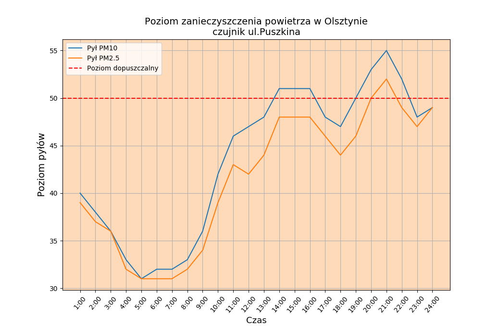
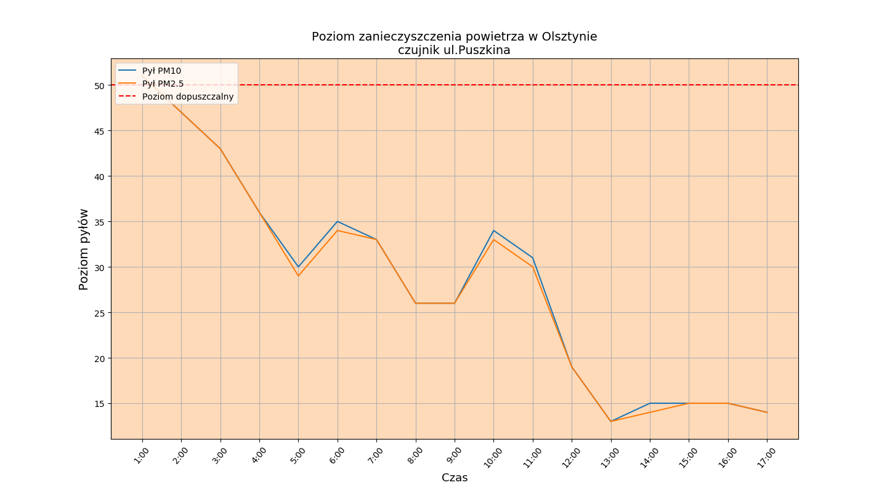

# smog
**WYKRES GRAFICZNY PRZEDSTAWIAJĄCY ZANIECZYSZCZENIE POWIETRZA W OLSZTYNIE**

Zastosowano:
- python
- pandas 
- matplotlib
- numpy
- http://powietrze.wios.olsztyn.pl/dane-pomiarowe/automatyczne/stacja/36/parametry/16-116/dzienny/20.12.2018

Dane w formie pliku csv pobierane systemu monitoringu jakości powietrza WIOŚ w Olsztynie.
Plik z pomiarami wczytywany jest poprzez bibliotekę pandas.
Ostatnie 3 wiersze w pliku csv to podsumowanie statystyczne i nie są brane pod uwagę w wykresie.
Dane pobierane w ciągu dnia są niepełne i dla kolejnych godzin występują wartości -0.
Następuje konwersja danych na wartości numeryczne, zamiana niewłaściwych wartości na NaN oraz wykasowanie NaN.

